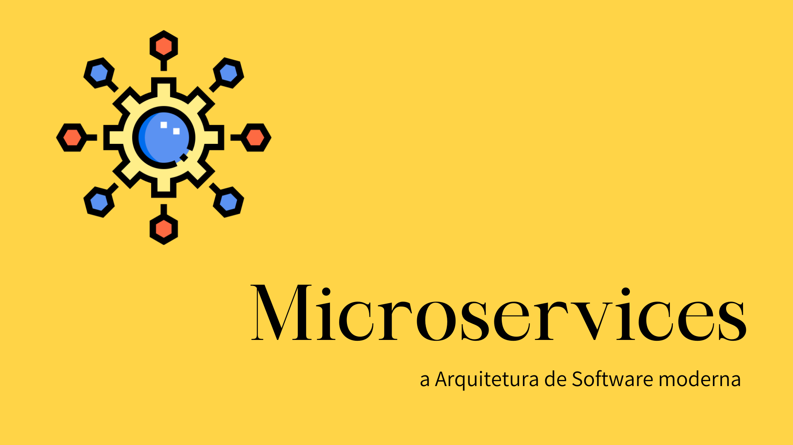

 

# Microservices

 

  <a href="#-tecnologias">Tecnologias</a>&nbsp;&nbsp;&nbsp;|&nbsp;&nbsp;&nbsp;  
  <a href="#-projeto">Projeto</a>&nbsp;&nbsp;&nbsp;|&nbsp;&nbsp;&nbsp;  
  <a href="#-gif">Gif</a>&nbsp;&nbsp;&nbsp;&nbsp;&nbsp;&nbsp;

 

## 🚀 Tecnologias

Esse projeto foi desenvolvido com as seguintes tecnologias:

- Java
- Spring Boot
- MySQL
- Insomnia
- Git e Github

 

## 💻 Projeto

Introdução aos estudos de Microservices.
Criando um Microsserviços de envio de e-mail junto com a @michelliBrito, utilizei o MySql como meu banco de dados e o Insomnia para os testes.

 

## 🔨 Funcionalidades do projeto

Abaixo um exemplo visual do projeto:

 

## 📁 Acesso ao projeto

Acesso ao código fonte, clique [AQUI!](https://github.com/Thamyresmya/Microservices-Email)

 

Me siga nas redes sociais:
- [Linkedin](https://www.linkedin.com/in/thamyrescavalcante/)
- [Instagran](https://www.instagram.com/thamyres__cavalcante/)

 

---

Feito com ♥ by Thamyres Cavalcante.

